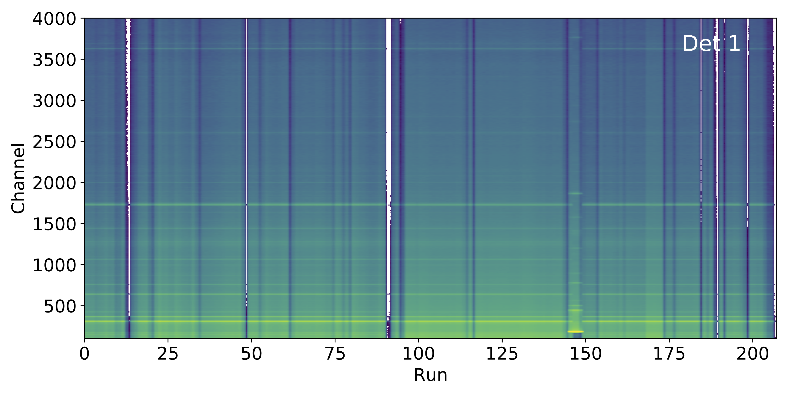

# DriftCheck



[](LICENSE)

DriftCheck is a python script for the visual inspection of detector drifts using GASPware data.

## Requirements

* Python>=3.8
* [numpy](https://numpy.org/)
* [matplotlib](https://matplotlib.org/)
* [tqdm](https://tqdm.github.io/)

## Usage

The `DriftCheck` code is used to create plots highlighting the time stability of detectors:

```bash
./DriftCheck.py -h
usage: DriftCheck.py [-h] [--full] [--write] [--clear] 
					 [--dest DESTINATION] [--dets NUM DETS]
                     [--range RANGE RANGE]
                     PATTERN

Create spectra over run number from GASPware matrices.

positional arguments:
  PATTERN              path to and name pattern of matrices

optional arguments:
  -h, --help           show this help message and exit
  --full               create .txt files from matrices
  --write              store raw data of plots in .mat files
  --clear              delete created .txt files
  --dest DESTINATION   path where output is stored (default: current location)
  --dets NUM DETS      number of detectors (default: 25)
  --range RANGE RANGE  plot range for data axis (default: 0 8191)
```

The code expects individual ascii (`.txt`) files for each run and each detector.
If these are not available, 2d matrices with the detector numbers on the first axis 
and the spectrum of interest on the second can be provided using the option `--full`.
These matrices should be available for each run and have names `NAMEXXX.cmat`
where `XXX` denotes the run number.
In order to locate them, the name pattern `/path/to/NAME` 
has to be handed over to `DriftCheck`.

## License

The code is distributed under the 
terms of the GNU General Public License, version 3 or later.
For details see [LICENSE](LICENSE).

Copyright (C) 2021 Tobias Beck (tbeck@ikp.tu-darmstadt.de)

